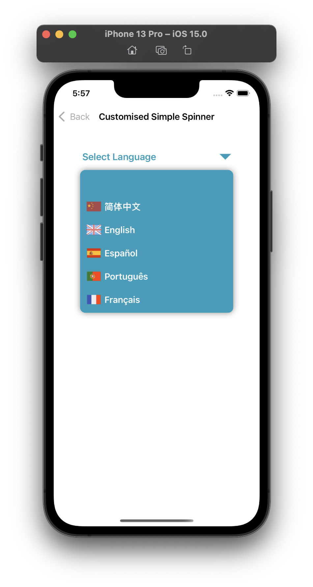
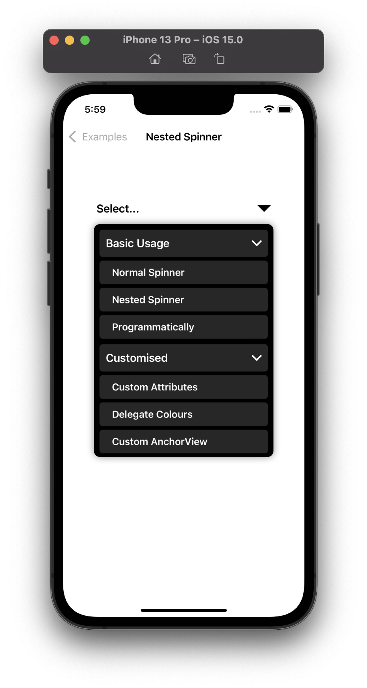
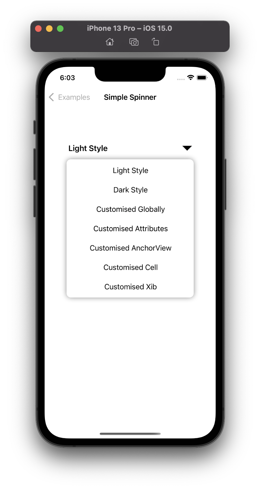
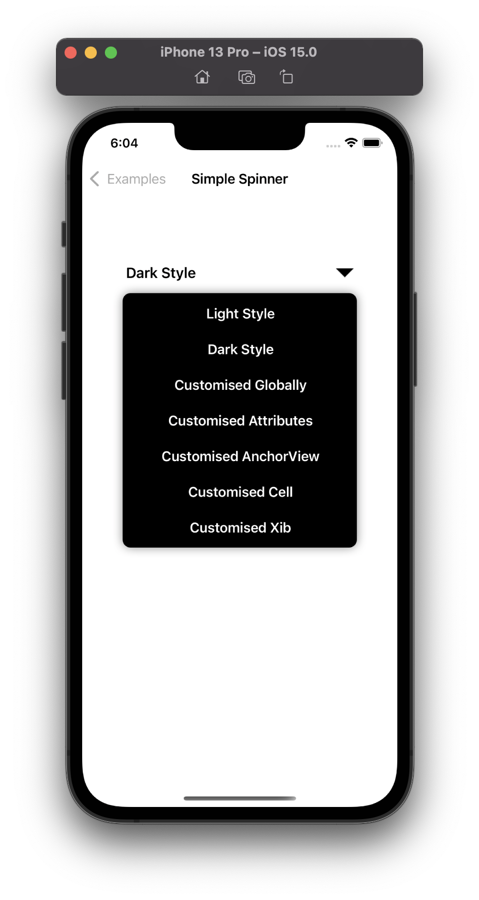
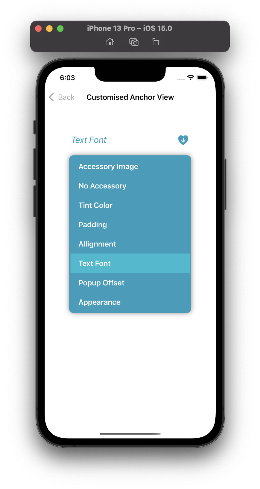

# NestedSpinner

[](https://travis-ci.com/wwwhackcom/NestedSpinner)
[](https://cocoapods.org/pods/NestedSpinner)
[](https://cocoapods.org/pods/NestedSpinner)
[](https://cocoapods.org/pods/NestedSpinner)

## Overview
Need an alternative ui control for users to easily select an item? Want to make user experience consistent as an Android Spinner instead of "UIPickView-wise" which uses a spinning-wheel style? NestedSpinner may be a choice for you. </br></br>
**NestedSpinner** not only provides a quick way to select one value from a set that works similarly as an Android spinner, but also it allows two levels nested spinner: `groupItem` which can individually be expanded | collapsed to show | hide its children `subItems`. </br></br>

<div align="center">
  <a href="https://github.com/wwwhackcom/NestedSpinner">
    
  </a>
  <a href="https://github.com/wwwhackcom/NestedSpinner">
    
  </a>
</div>

NestedSpinner is written in Swift for iOS, it imitates the implementation of Android Spinner, the key classes include:

- `NestedSpinnerView`
- `NestedSpinnerAnchorView`
- `NestedSpinnerPopupView`
- `NestedSpinnerAdapter`


## Requirements
- [x] Xcode 11.
- [x] Swift 5.
- [x] iOS 9 or higher.

## Installation
### CocoaPods

NestedSpinner is available through [CocoaPods](https://cocoapods.org). 
[CocoaPods](http://cocoapods.org) is a dependency manager for Cocoa projects. You can install it with the following command:
```bash
$ gem install cocoapods
```

To install NestedSpinner into your Xcode project, simply add the following line to your `Podfile`:

```ruby
pod 'NestedSpinner'
```
Then, run the following command:

```bash
$ pod install
```

## Usage
### Code-less Storyboard Implementation
Create a UIView for the spinner. Set the `Custom Class` of the UIView to be `NestedSpinnerView` in the **Identity Inspector**. Set the `Module` to `NestedSpinner` (ignore this step if you've manually added NestedSpinnerView to your project).

### Code Implementation
1. First, import:
```swift
import NestedSpinner
```

2. Set data for the adatper, set property `dataSource` of the `NestedSpinnerView` you just created to an array data for a normal spinner:
```swift
spinner.dataSource = arrayData
```
or set `dataTrees` for a nested spinner:
```swift
spinner.dataTrees = arrayDataTrees
```

3. Set property `anchorOffset` to decide the offset to the position of the anchor view:
```swift
spinner.anchorOffset = CGPoint(x: 0, y: spinner.bounds.size.height)
```

4. Set the closures to handle the actions:
```swift
spinner.selectionAction = { index, stringValue, userdata in
    
}
```
That's it.


### Data protocol
1. You can populate your own entity into an array and set to the data adapter, then it will be passed back to your selection clousre as userdata.
2. To show the title value of the groupItem or subItem, the entity you pass to the data adater needs to conforms to data protocol,   `NestedSpinnerDataSource` (for a normal spinner) or  `NestedSpinnerSubItem` (for a nested spinner), class `NestedSpinnerItem` is the required data entity consumed by the nested data adapter. 

### Style
NestedSpinner have two built-in styles, Light and Dark. It can also set gloable style for all the components or you can set it individually. Just check the style properties, please look at the proptery of `NestedSpinnerView` and the class `NestedSpinnerStyle`(https://github.com/wwwhackcom/NestedSpinner/blob/master/NestedSpinner/Classes/NestedSpinnerStyle.swift) for more details,

<div align="center">
  <a href="https://github.com/wwwhackcom/NestedSpinner">
    
  </a>
  <a href="https://github.com/wwwhackcom/NestedSpinner">
    
  </a>
</div>

### Customization
1. Customise your own anchor view, please look at the examples  `CustomisedSpinnerAnchorViewController`(https://github.com/wwwhackcom/NestedSpinner/blob/master/NestedSpinner/Classes/CustomisedSpinnerAnchorViewController.swift)

<div align="center">
  <a href="https://github.com/wwwhackcom/CustomisedAnchor">
    
  </a>
</div>

2. Customise your own groupItem cell or subItem xib. please look at the examples for more details

### ObjC support
`NestedSpinner` supports ObjC, please go to the example folder `ObjcExample`, and run the command
```bash
$ pod install
```

## Author

Nick Wang, wwwhackcom@qq.com

## License

NestedSpinner is available under the MIT license. See the LICENSE file for more info.
